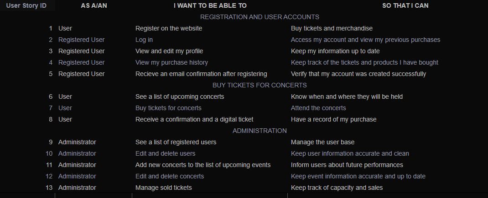

# Blackout Pirates

Blackout Pirates is a fictional e-commerce site that offers ticket purchasing 
services for concerts of the fictional rock band Blackout Pirates.

Users have the option to register before completing their ticket purchase.

The site features the ability to purchase tickets for future concerts, 
managed through a CRUD interface by the site administrator.

Stripe is used for secure payments and is currently set to “test” mode. For test payments use:
- Card number: 4242 4242 4242 4242
- CVC: 424
- Exp: any future date

## User Stories

The document used for user stories can be found at: [blackoutStories.xlsx](documentation/blackoutStories.xlsx)

## Features

### Main Features:

- **Sign Up**
- **Log In**
- **Log Out**
- **Dashboard** to add a new concert (for administrators)
- **Add a new concert**
- **Edit a concert**
- **Delete a concert**
- **Authentication features:** All handled by Django's AllAuth app.
- **Basket**
- **Checkout**

### Navigation Bars

## Technologies and Languages

### Languages
- HTML
- CSS
- JavaScript
- Python

### Frameworks
- [Django](https://www.djangoproject.com/): Backend framework.
- [Bootstrap v5.3](https://getbootstrap.com/): Frontend framework.

### Django Tools and Apps
- Django v5.0.3
- [dj-database-url v0.5.0](https://pypi.org/project/dj-database-url/): For setting the DATABASE_URL.
- [django-allauth v0.61.1](https://docs.allauth.org/en/latest/): User authentication and account management.
- [django-crispy-forms v2.1](https://django-crispy-forms.readthedocs.io/en/latest/): For rendering forms neatly.
- [crispy-bootstrap5 v2024.2](https://pypi.org/project/crispy-bootstrap5/): Required for use of crispy forms with Bootstrap 5.
- [django-environ v0.11.2](https://django-environ.readthedocs.io/en/latest/): For configuring the application with environment variables.
- [Gunicorn v21.2.0](https://docs.djangoproject.com/en/4.2/howto/deployment/wsgi/gunicorn/): WSGI server for deployment.

### Tools and Technology

- [SQLite3](https://www.sqlite.org/index.html): Local database storage before deployment.
- [Alwaysdata](https://www.alwaysdata.com.com/): Structured data storage.
- [Stripe](https://stripe.com/gb): Used for secure payments.
- [Heroku](https://dashboard.heroku.com/): Deployment of the full-stack site.
- [Git](https://git-scm.com/): Version control.
- [GitHub](https://github.com/): Storing code for the project.
- [VS Code](https://code.visualstudio.com/): IDE used for development.
- [Figma](https://www.figma.com/): Used to create wireframes.
- [Logo.com](https://logo.com/): Used to create the logo.
- [Lucidchart](https://www.lucidchart.com/pages/): For ERD creation.

[Back to main navigation](#contents)

## Testing

For all testing, please refer to [TESTING.md](TESTING.md).
