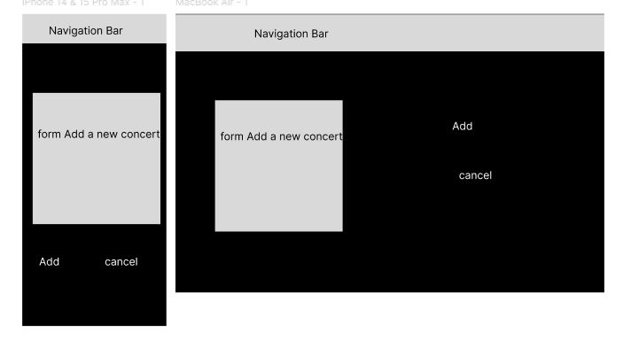

# Blackout Pirates

Blackout Pirates is a fictional e-commerce site that offers ticket-purchasing services for concerts of the fictional rock band Blackout Pirates.

Users have the option to register before completing their ticket purchase.

The site features the ability to purchase tickets for future concerts, 
managed through a CRUD interface by the site administrator.

Stripe is used for secure payments and is currently set to “test” mode. For test payments use:
- Card number: 4242 4242 4242 4242
- CVC: 424
- Exp: any future date

## User Stories

The document used for user stories can be found at: [blackoutStories.xlsx](documentation/blackoutStories.xlsx)

## Features

### Main Features:

- **Sign Up**
- **Log In**
- **Log Out**
- **Dashboard** to add a new concert (for administrators)
- **Add a new concert**
- **Edit a concert**
- **Delete a concert**
- **Authentication features:** All handled by Django's AllAuth app.
- **Buy a ticket**
- **Update ticket quantity**
- **View user basket**
- **Checkout**

### Stories Testing

In the following document, both the user stories and admin stories are explained in more detail.

[Stories](Stories.md)

## Design
The design has opted for a sober and simple approach.

### Wireframes

### Colors

* The main color is black, used as the background color.  
* In contrast, white in the shade #fafafa is used for text.   
* An orange color in the shade RGB (227, 92, 30) is used for links.

### Fonts
The following fonts have been imported from Google Fonts:

* Rock Salt
* Pirata One

These fonts are primarily used in links.

## Technologies and Languages

### Languages
- HTML
- CSS
- JavaScript
- Python

### Frameworks
- [Django](https://www.djangoproject.com/): Backend framework.
- [Bootstrap v5.3](https://getbootstrap.com/): Frontend framework.

### Django Tools and Apps
- Django v5.0.3
- [dj-database-url v0.5.0](https://pypi.org/project/dj-database-url/): For setting the DATABASE_URL.
- [django-allauth v0.61.1](https://docs.allauth.org/en/latest/): User authentication and account management.
- [django-crispy-forms v2.1](https://django-crispy-forms.readthedocs.io/en/latest/): For rendering forms neatly.
- [crispy-bootstrap5 v2024.2](https://pypi.org/project/crispy-bootstrap5/): Required for use of crispy forms with Bootstrap 5.
- [django-environ v0.11.2](https://django-environ.readthedocs.io/en/latest/): For configuring the application with environment variables.
- [Gunicorn v21.2.0](https://docs.djangoproject.com/en/4.2/howto/deployment/wsgi/gunicorn/): WSGI server for deployment.

### Tools and Technology

- [SQLite3](https://www.sqlite.org/index.html): Local database storage before deployment.
- [Alwaysdata](https://www.alwaysdata.com.com/): Structured data storage.
- [Stripe](https://stripe.com/gb): Used for secure payments.
- [Heroku](https://dashboard.heroku.com/): Deployment of the full-stack site.
- [Git](https://git-scm.com/): Version control.
- [GitHub](https://github.com/): Storing code for the project.
- [VS Code](https://code.visualstudio.com/): IDE used for development.
- [Figma](https://www.figma.com/): Used to create wireframes.

## Testing

Due to the lack of time to complete this project, and since I have already performed the necessary checks for HTML, CSS, and JavaScript in the previous projects delivered, I have focused on conducting automated tests for this project. Given the time constraints, the tests have only been conducted for the concerts app.

### Manual testing

The manual testing cases can be found in the following file.

[manualTesting.xlsx](documentation/manualTesting.xlsx)

### Automated testing

A total of two test classes and seven test cases have been created.

I have written tests for the form, for which I created a class named **ConcertFormTest** with the goal of testing the functionality of the ConcertForm.

First, we create the data needed for the test.

Within this class, we have the following test cases:

* **test_form_fields_placeholder:** Verify that the placeholders for the form fields are correct.
* **test_form_valid_data:** Test that the form is valid when correct data is provided.
* **test_form_invalid_data:** Test that the form is invalid when incorrect data is provided.

---  
Additionally, tests have been conducted for the views. 
The class **TestViews** aims to test various views related to concerts.

As with the previous case, the necessary data has been created to conduct the different tests.

Within this class, we have the following test cases:

* **test_all_concerts:** Verify that the all_concerts view returns a 200 status code (success) and uses the correct template concerts/concerts.html.
* **test_concert_detail:** Verify that the concert_detail view returns a 200 status code and uses the correct template concerts/concert_detail.html.
* **test_add_concert_user:** Verify that a regular user is redirected to the main page when attempting to access the add_concert view.
* **test_superuser_access:** Verify that a superuser can access the add_concert view without being redirected. 

Once the environment and test cases were prepared, the tests were executed, and as shown in the following image, all tests were successful.

## Deployment

The site was deployed to Heroku.

The link to the live website is here: [Blackout Pirate]()

The code can be found on GitHub: [Blackout Pirate](https://github.com/devjldp/blackout-pirates)