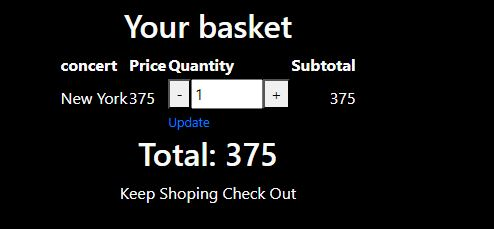

# Stories

## User Stories

* **Login.** The user should be able to enter their username and password.

* **View a list of concerts and buy a ticket.** The user should be able to see a list of upcoming concerts. The user should be able to click on a concert to see more details.

* **Add concert to the basket.** The user should be able to select a concert and specify the quantity of tickets. The user should be able to view all the tickets added to their basket.

* **Checkout.** The user should be able to proceed to checkout from the basket view. The user should be able to enter payment details and complete the purchase.

* **Logout.** The user should be able to log out from any page in the application.

## Admin Stories

* **Login.** The admin should be able to enter their username and password. The navigation bar should be different

* **Add a new concert.** The admin should be able to navigate to the "Add Concert" page. The admin should be able to enter concert details including city, date, and price.

  

* **View All concerts**

  

* **Edit a concert.** The admin should be able to navigate to the "Edit Concert" page for a specific concert. The admin should be able to modify the concert details including city, date, and price. The system should save the updated concert details and reflect the changes in the list of available concerts.

* **Delete a concert.** The admin should be able to navigate to the "Delete Concert" option for a specific concert. the system should remove the concert from the list of available concerts.
  

* **Log out** The user should be able to log out from any page in the application.